#### AWS Config

1)  Go to the AWS Search Service bar and find *AWS Config*. Press *Get started*.

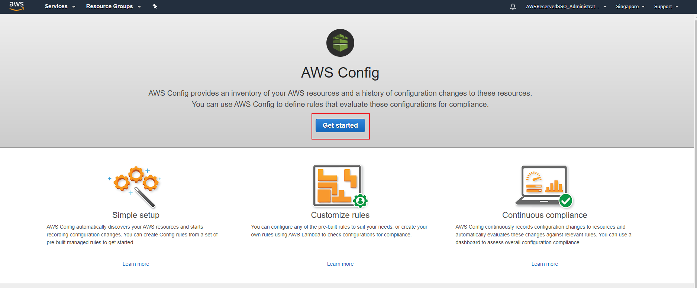

2)  In the *Settings* section make sure you select both options in *All
    resources* and make sure that a S3 bucket is configured to store the
    configuration history and configurations snapshot.

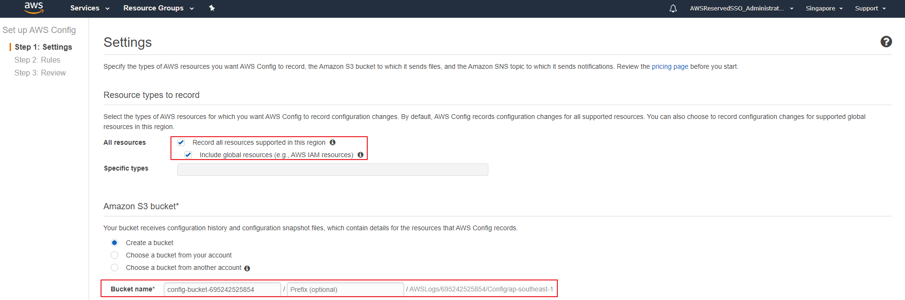

3)  In the *SNS topic* provide a name for the new topic created. In this case
    *config-topic*, press *Next* once done.

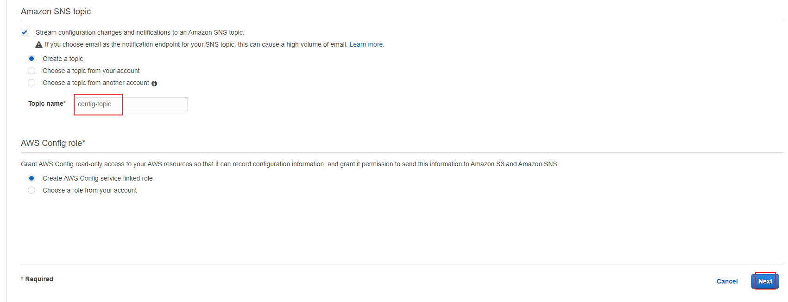

4)  Select the following 3 rules:
* ec2-instance-detailed-monitoring-enabled
* cloudtrail-enabled 
* multi-region-cloudtrail-enabled

**:heavy_exclamation_mark: Use the search bar to find them.** Click *Next* once done.

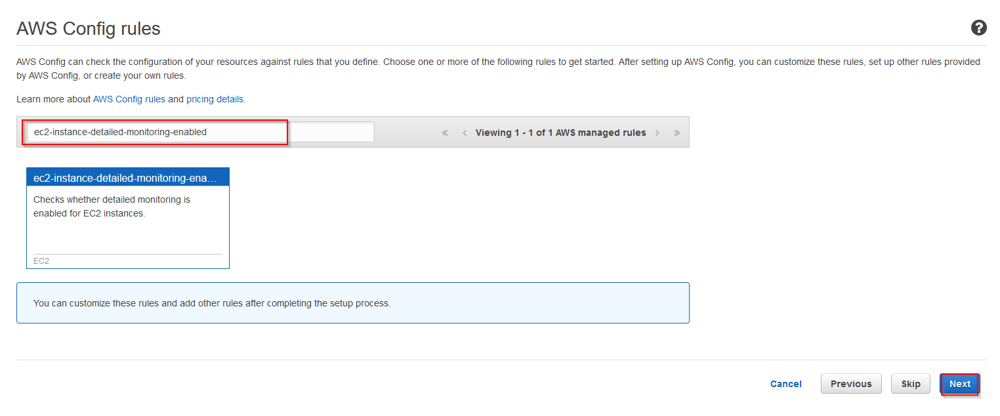

5).  Review the configuration page and click *Confirm*.

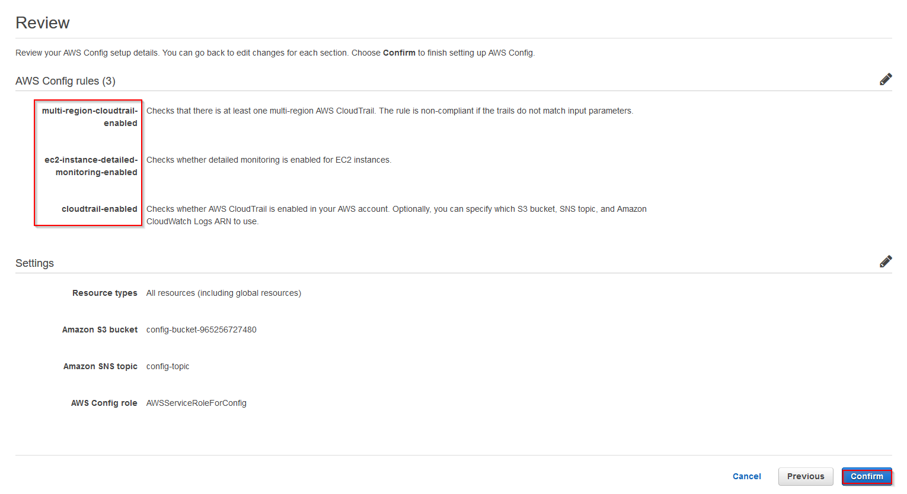

6)  You will wait a couple of minutes till the rules are set up.

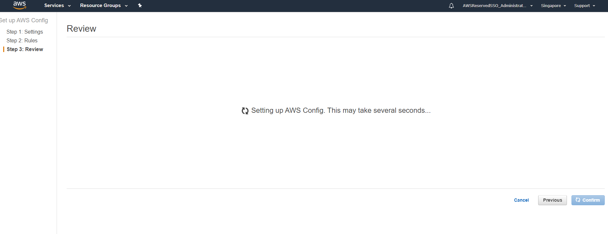

7)  Refresh the console to make sure that all the metrics are displayed on the
    console

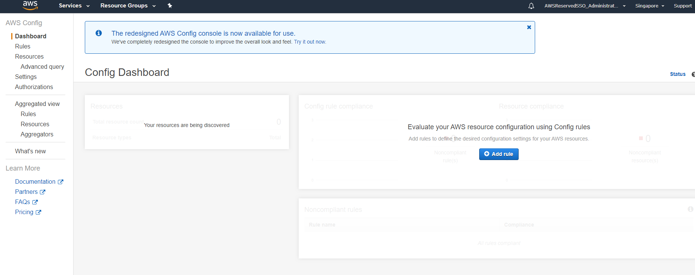

8)  Once done you will see the following the dashboard

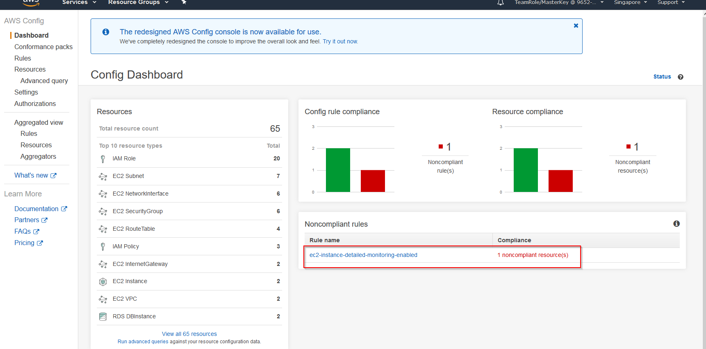

As we can see there is an alarm raised. This alarm states that there is an EC2 instance that does not have "Detailed Monitoring" Enabled. Let’s proceed and remediate this
alarm.

9)  Lets click on the alarm and see what EC2 instance does not comply with our configuration rule. Take note of the instance ID so we can remediate this alarm.

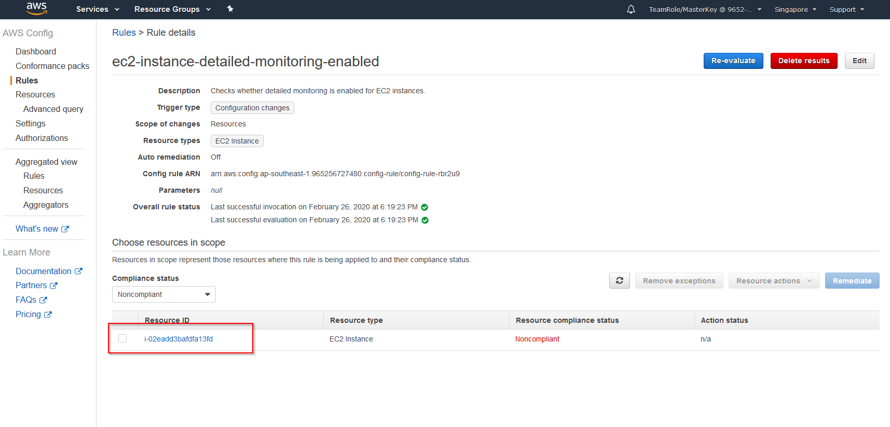

10)  Now that we have the EC2 instance that is not compliant let's go and enable the "Detaied Monitoring". Go to the *EC2 console* and under __Instances__ search for the 
instance ID that has the alarm. 

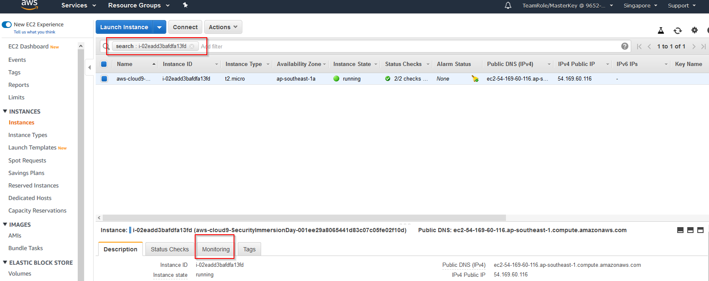

11)  Click on the monitoring tab after selecting the EC2 instance and then click __"Enable Detailed Monitoring"__.

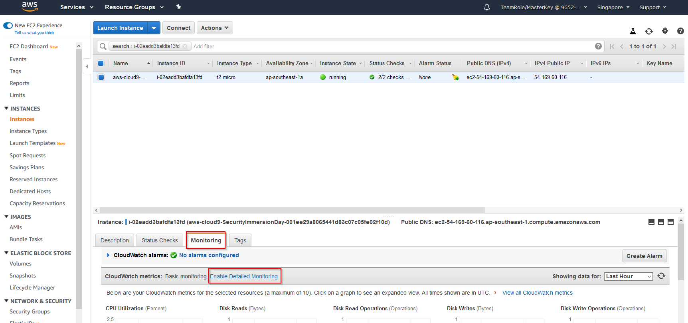

12)  Click __Yes, Enable__ and then click __Close__ .

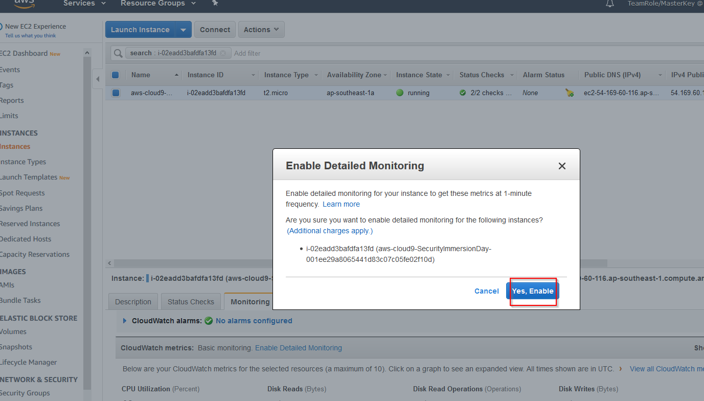

13)  After enbling the detail monitoring, return to the AWS Config Console and re-evaluate the rule that shows and alarm.

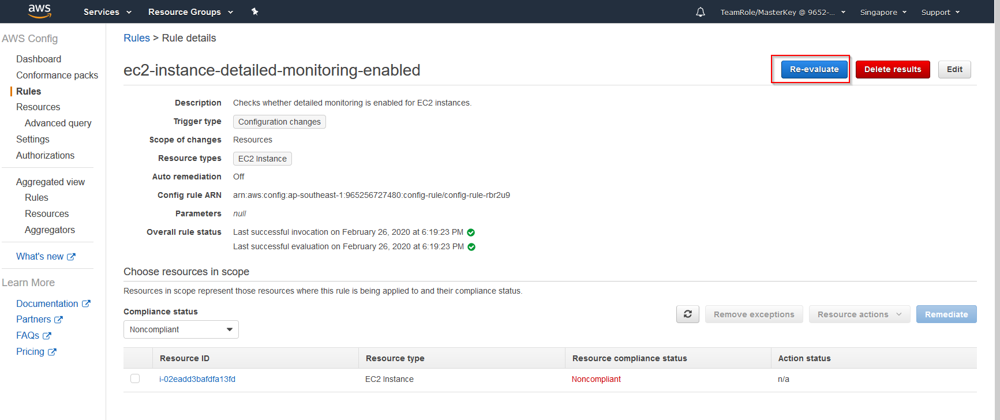

Refresh the page a couple of times and the alarm should dissapear.

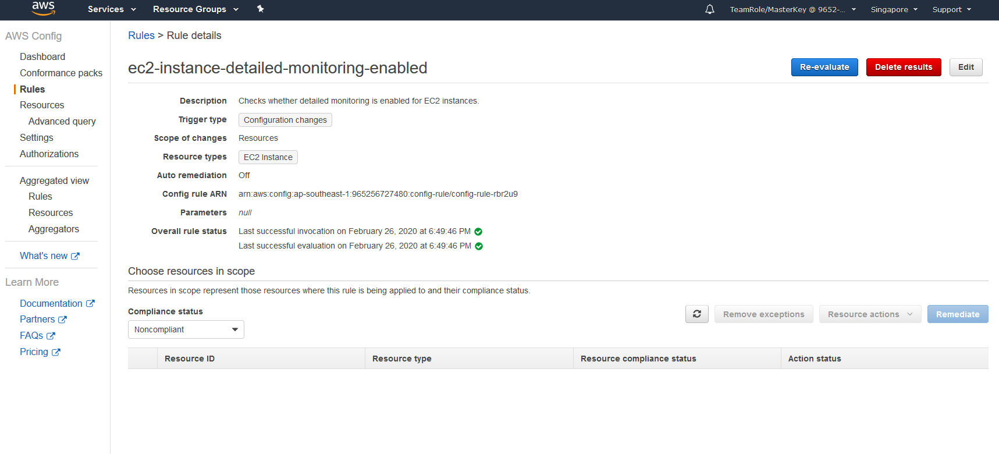

14) Check also the dashboard and make sure that no alarms are being reported

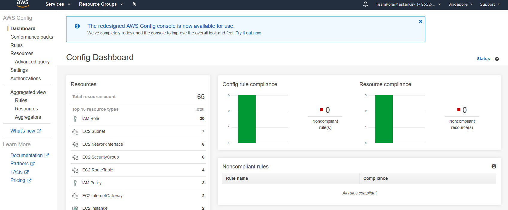

Now that all the alarms dissapeared we can proceed to the [next lab (KMS Lab)](../04-KMS-Lab/README.md)
