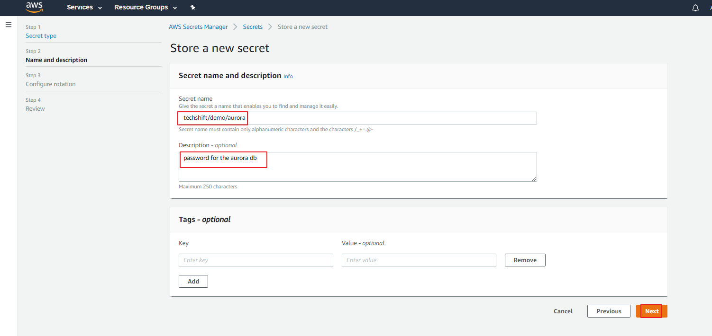
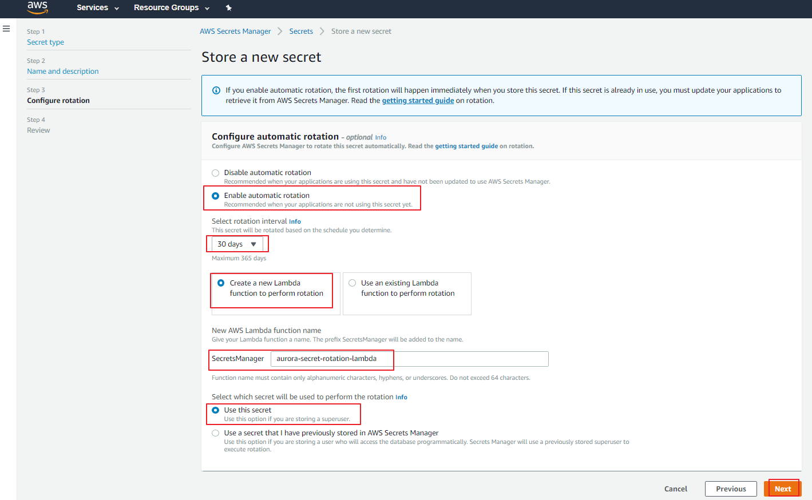
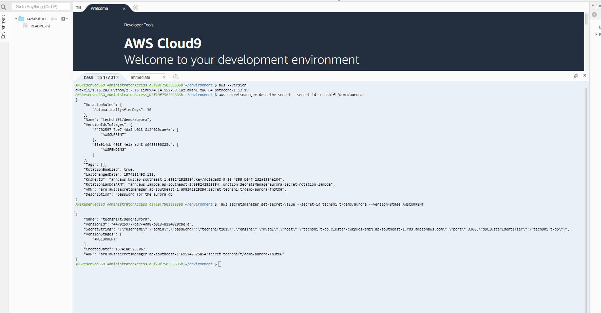

# LAB 5 - AWS Secrets Manager 
#### To create and store your secret

1) Sign in to the AWS Secrets Manager console

2) On either the service introduction page or the secrets list page,
    choose **Store a new secret**.

3) On the **Store a new secret** page, choose **Credentials for Database**, in
   the username type *admin and in the password box type techshift2019. Choose
   the security created in the previous lab called techshiftkey2019* and select
   the database created in the previous lab.


4)  Give the *Secret* a name – *techshift/demo/aurora*. Add a description and
    press *Next*.



5)  Enable automatic rotation for 30 days using a Lambda function and name it
    *aurora-secret-rotation-lambda* and press *Next*.



6)  In the review page press *Store*.


#### To retrieve your secret in the AWS Secrets Manager console

1) On the secrets list page, choose the name of the new secret that you created
    in the previous section.

>   The details page for your secret appears.

2) In the **Secret value** section, choose **Retrieve secret value**.

3) You can view your secret as either key-value pairs, or as a JSON text
    structure.

#### To retrieve your secret in the AWS Secrets Manager from CLI

1) Go to your Cloud9 Console created in the previous labs.



2)  In the console type the following commands:

```
   aws secretsmanager describe-secret --secret-id techshift/demo/aurora
```

The output will look like this:

```
{
    "RotationRules": {
        "AutomaticallyAfterDays": 30
    },
    "Name": "techshift/demo/aurora",
    "VersionIdsToStages": {
        "44702597-7be7-4da8-b013-8124020caefe": [
            "AWSCURRENT"
        ],
        "38a914cb-4015-4e1a-ad48-d0483690823c": [
            "AWSPENDING"
        ]
    },
    "Tags": [],
    "RotationEnabled": true,
    "LastChangedDate": 1574181498.181,
    "KmsKeyId": "arn:aws:kms:ap-southeast-1:695242525854:key/dc1eda08-9f36-4855-b047-2d2a8994e204",
    "RotationLambdaARN": "arn:aws:lambda:ap-southeast-1:695242525854:function:SecretsManageraurora-secret-rotation-lambda",
    "ARN": "arn:aws:secretsmanager:ap-southeast-1:695242525854:secret:techshift/demo/aurora-TnOtO6",
    "Description": "password for the aurora db"
}
```
...and the command:

```
   aws secretsmanager get-secret-value --secret-id techshift/demo/aurora --version-stage AWSCURRENT
```
The output will look like this:

```
{
    "Name": "techshift/demo/aurora",
    "VersionId": "44702597-7be7-4da8-b013-8124020caefe",
    "SecretString": "{\"username\":\"admin\",\"password\":\"techshift2019\",\"engine\":\"mysql\",\"host\":\"techshift-db.cluster-cwkpkosksmzj.ap-southeast-1.rds.amazonaws.com\",\"port\":3306,\"dbClusterIdentifier\":\"techshift-db\"}",
    "VersionStages": [
        "AWSCURRENT"
    ],
    "CreatedDate": 1574180923.067,
    "ARN": "arn:aws:secretsmanager:ap-southeast-1:695242525854:secret:techshift/demo/aurora-TnOtO6"
}
```
Proceed to the [next lab (WAF Lab)](../06-WAF-Lab/README.md)
