# LAB 6 - AWS Web Application Firewall

**:heavy_exclamation_mark: Before we start check on http://whatismyip.com what is your public IP. We will be using it to block access to our ALB with AWS WAF.**

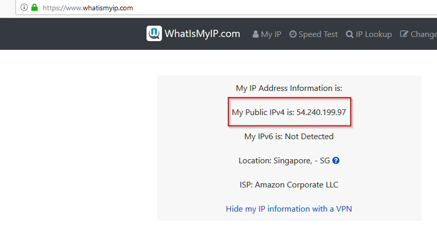

Take note of your public IP and write it down on a scratchpad.

**:heavy_exclamation_mark: Take note also of the ALB DNS name**

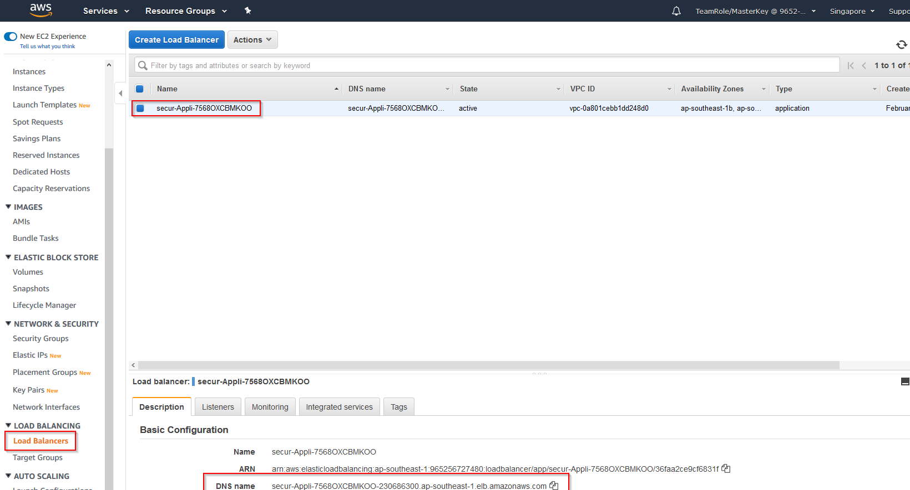

And paste the DNS name in a new tab.

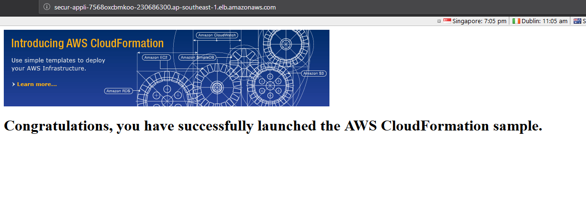

*Now that we have this information lets start configuring the WAF*

1)  Got to the AWS WAF console and select *Go to AWS WAF*.

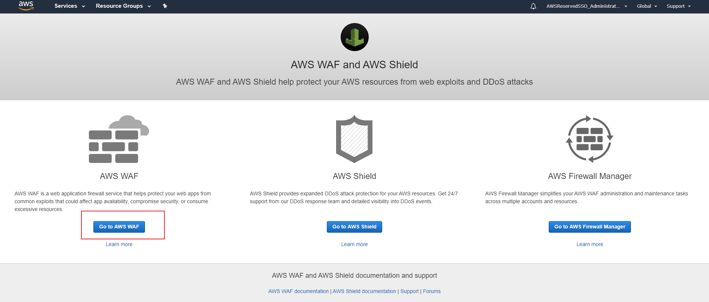

2) On left side menu you will see *IP sets*. Click on that section and select **Create IP set**. Make sure you are in the *Singapore* Region

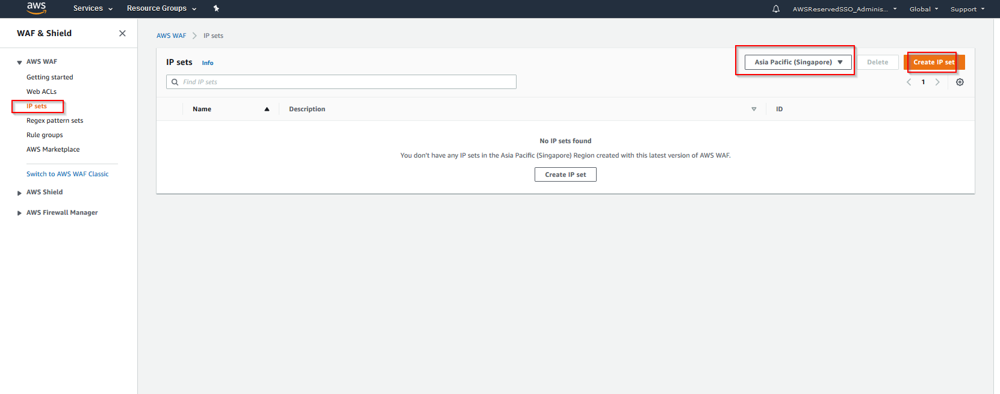

3) In the IP set wizzard fill in the name of the set, Region and **your public IP**. **DO NOT USE THE IP highligted in the image**. You must use your public IP.

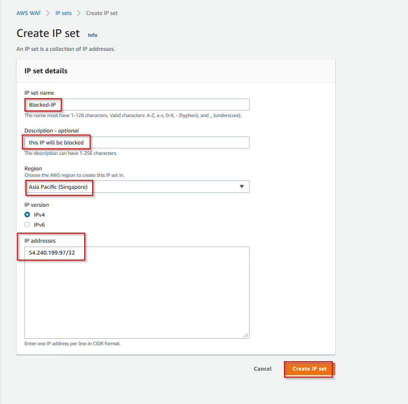

4) Once the IP set is successfully created we will see it in the list

5)  Now from the left side menu go to *Getting started* and click on *Create Web ACL*. The web ACL wizard will guide us through all
    the steps necessary to create the conditions and rules that are necessary in a Web ACL.

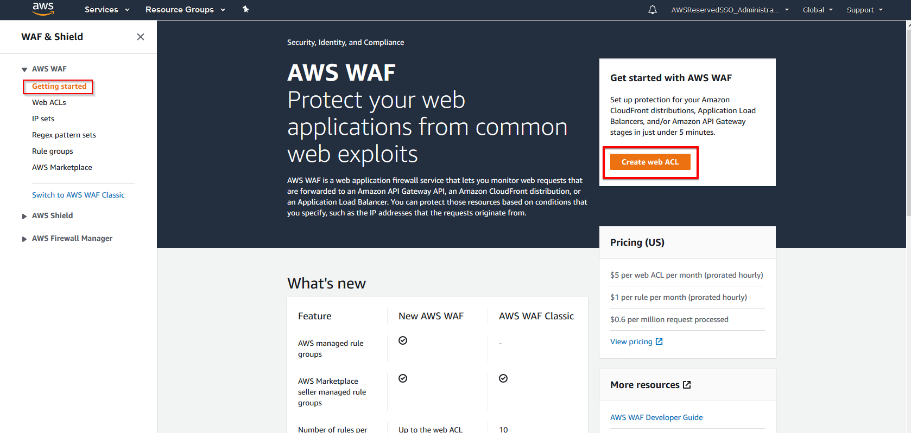

6)  Fill in the Web ACL name, description, **the region**, CloudWatch Metric name  and click *Add AWS Resources*.
    once done.

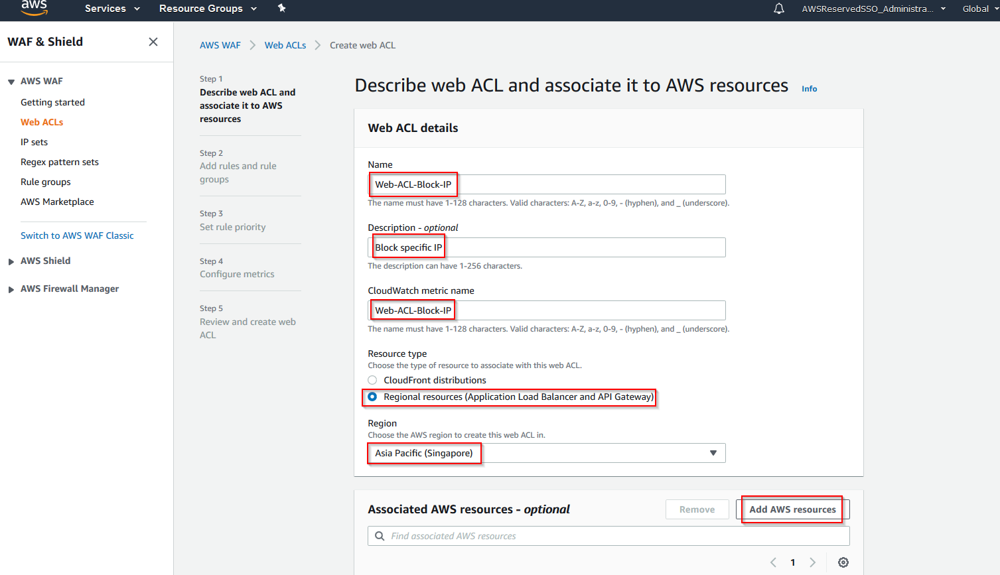

7) Select the Application Load Balancer created in the previous Lab. This might be named *techshift-alb* or other name that you might have used.

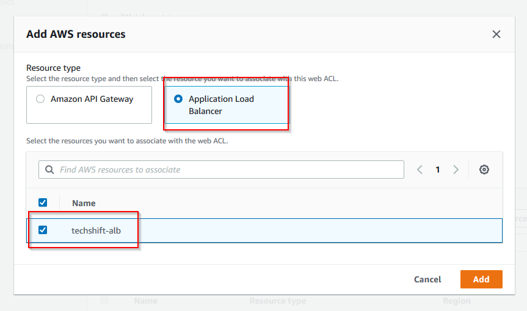

8)  Once the AWS resource is added press **Next**

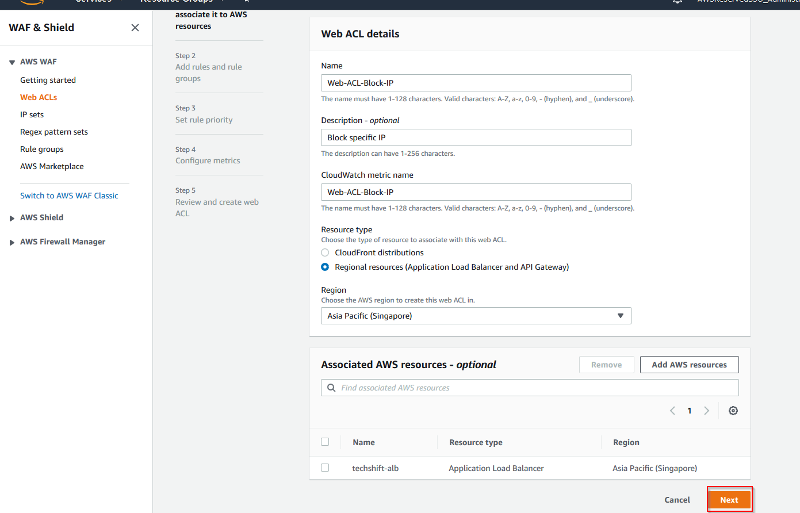

9)  In the *Add rules and rule groups* section click on **Add rules - > Add my own rules and rules groups**.

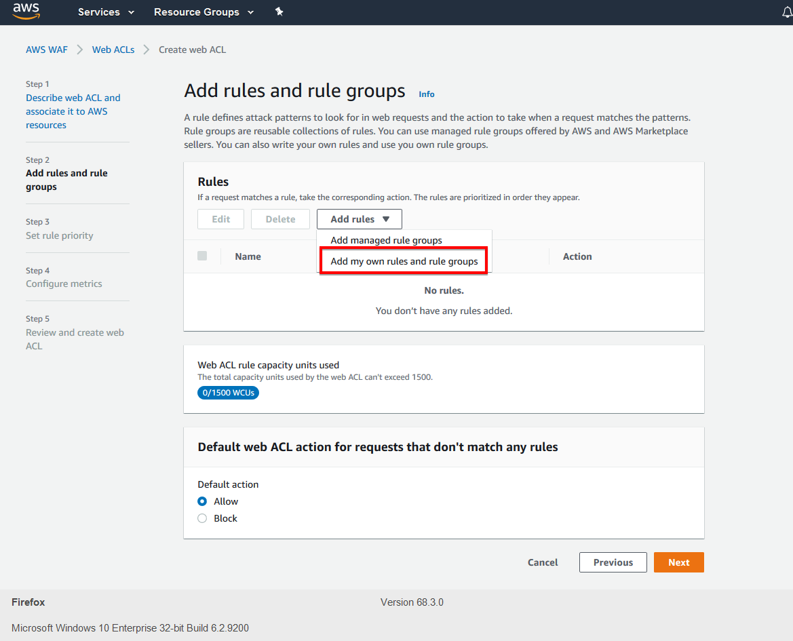

10)  In the rule creation wizard select the **Rule builder** option and fill in all the fields as presented in the image below. Make sure you select the **IP Set** created in the previous steps.

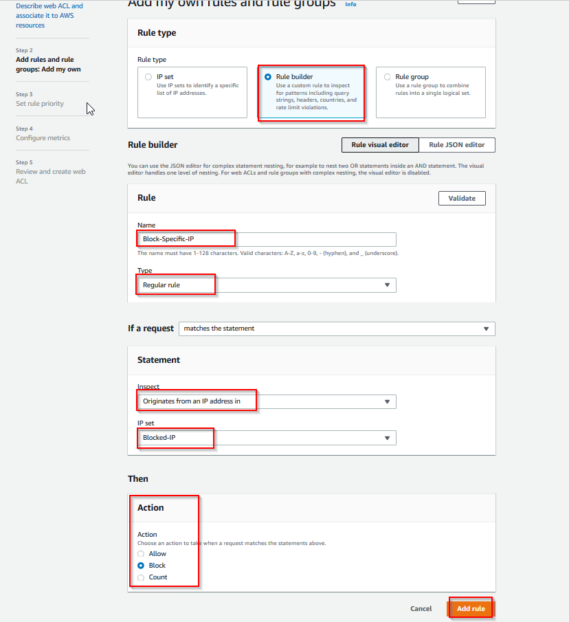

11)  Once the rule has been created press *Next* to add the rule

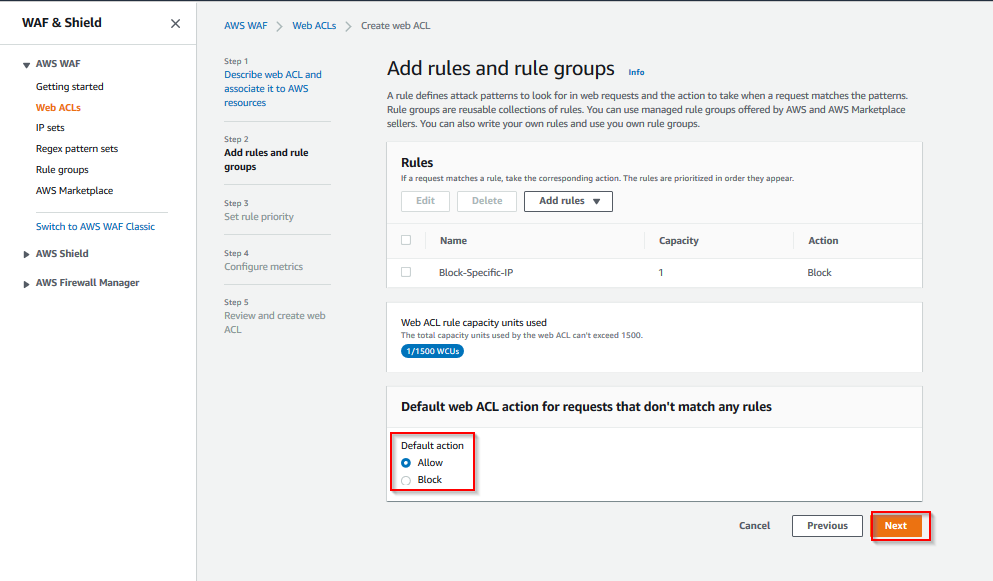

12)  Since this is the only rule we have there is no priority to be set so we are just going to move to the *Next* step.

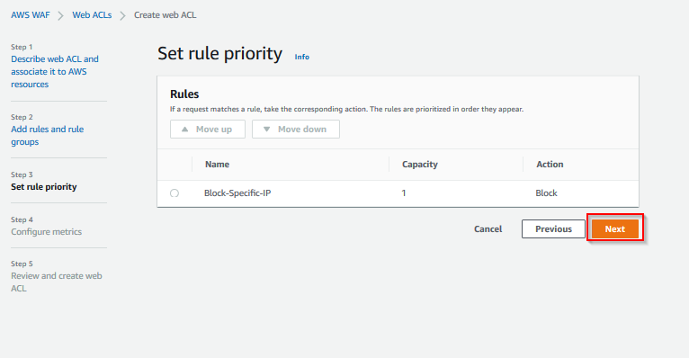

13)  We will be configuring CloudWatch Metrics to measure the block rate of the rule. Press *Next* at this step.

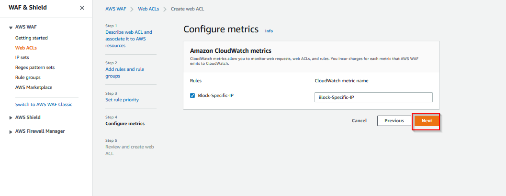

14)  Go over the summary of the Web ACL and click *Create web ACL* at the bottom of the page

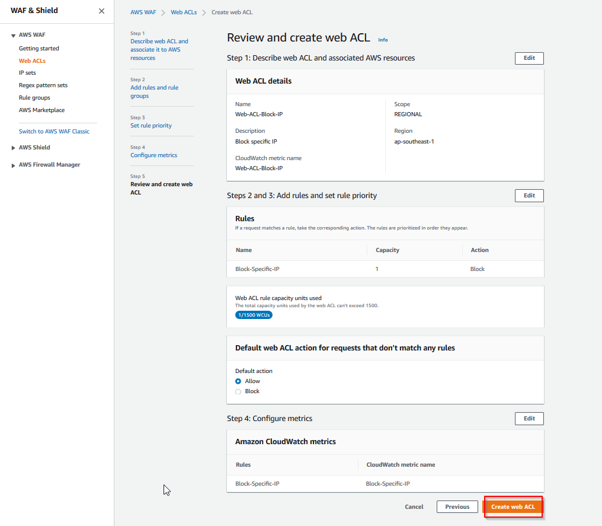

15) You will see a success message once the rule is created properly

Once the creation is completed go ahead and test it on your browser by accessing the DNS of the ALB that the WEB ACL is applied on. You will
notice that you are not allowed to access you ALB. since the traffic is com

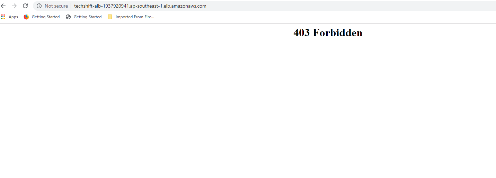

You can try accessing the website via your phone and you will see that the web page will be successfully displayed.

After completing this activity you can move on to [the next lab (Analyzing CloudTrail Logs with Athena)](../07-CT-Athena-Lab/README.md)
