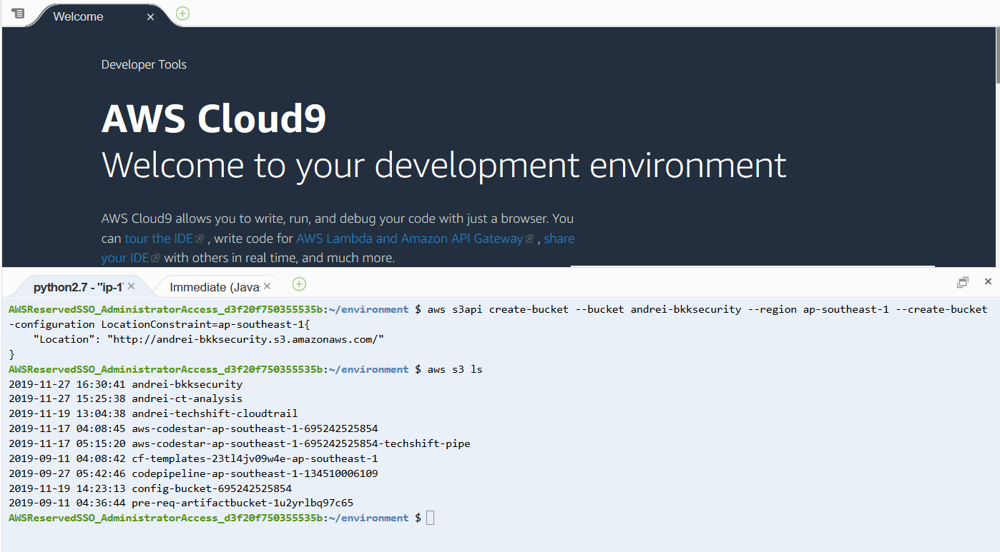
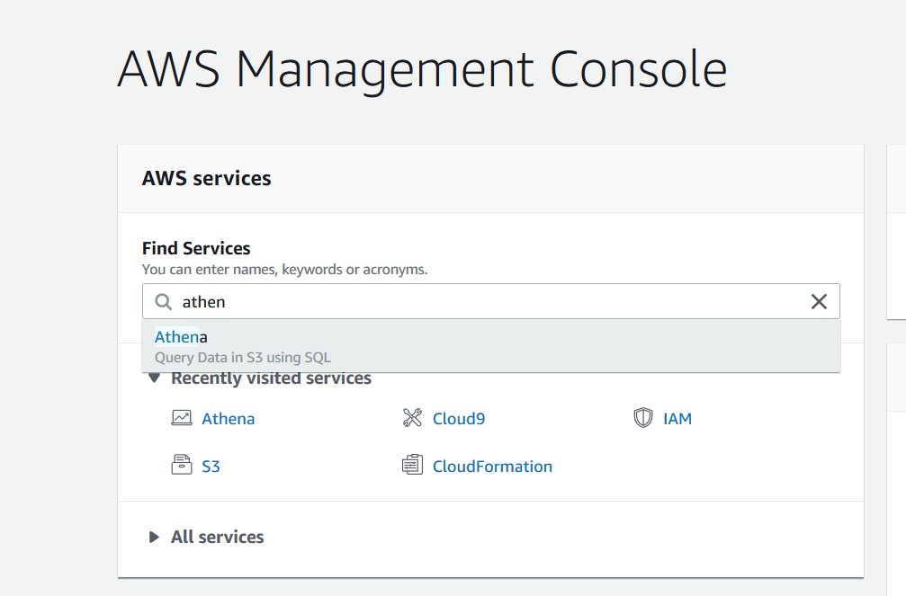
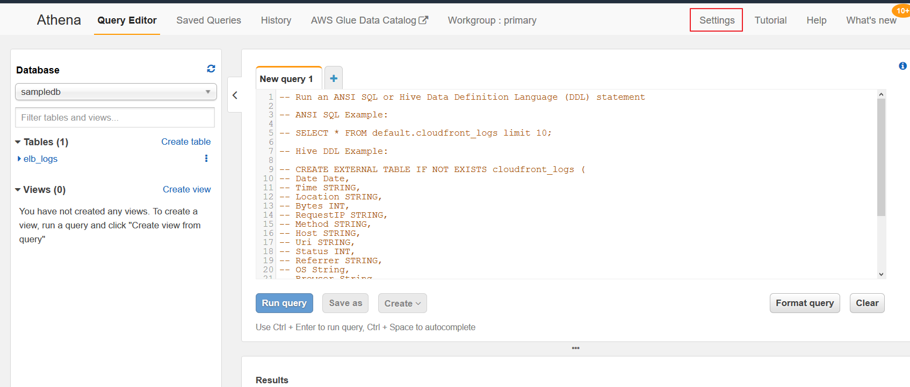
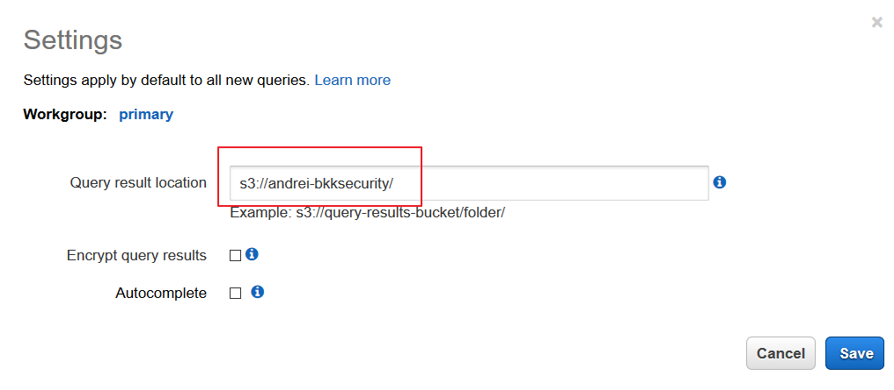
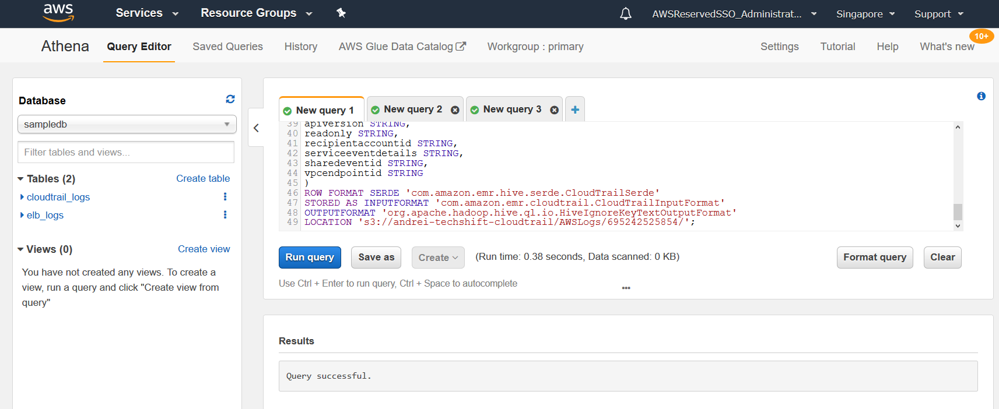
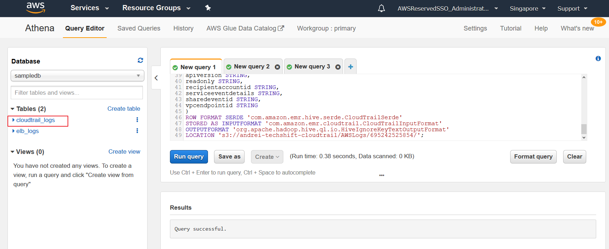
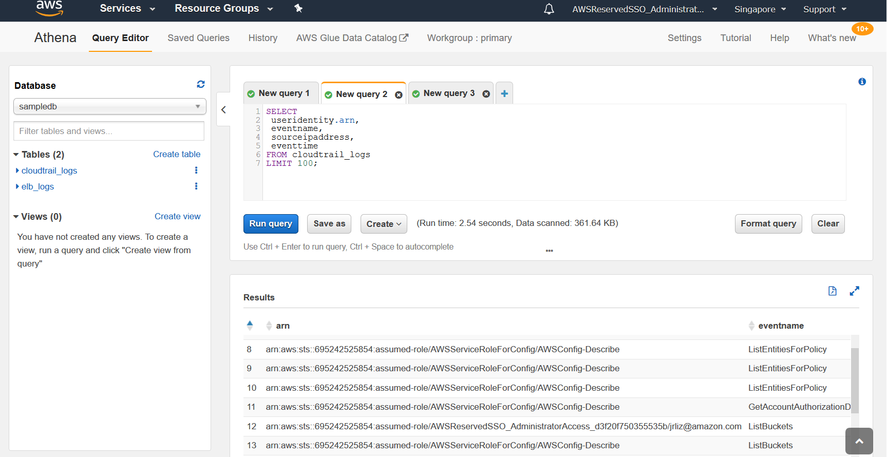

# Analyzing Cloud Trail Logs with Athena

1. For this exercies we will need an S3 bucket. To create an S3 bucket execute the following command in the Cloud9 Terminal
 **:heavy_exclamation_mark: Make sure you use your replace the bucket name in the command below with a unique name.**

```
aws s3api create-bucket --bucket [yourname-bkksecurity] --region ap-southeast-1 --create-bucket-configuration LocationConstraint=ap-southeast-1
```


2. Go to the Athena Console



3. Press *Get Sarted*

4. Click *Settings*



5. In the setings area add the name of the bucket that you created in Step 1 of this lab. Once done click *Save*



6. In the Query Editor Copy-Paste the extract bellow.
 **:heavy_exclamation_mark: Make sure you change the ___s3://CloudTrail_bucket_name/AWSLogs/Account_ID/___ with the name and account ID of your Cloud Trail Bucket.**

```
CREATE EXTERNAL TABLE cloudtrail_logs (
eventversion STRING,
useridentity STRUCT<
               type:STRING,
               principalid:STRING,
               arn:STRING,
               accountid:STRING,
               invokedby:STRING,
               accesskeyid:STRING,
               userName:STRING,
sessioncontext:STRUCT<
attributes:STRUCT<
               mfaauthenticated:STRING,
               creationdate:STRING>,
sessionissuer:STRUCT<
               type:STRING,
               principalId:STRING,
               arn:STRING,
               accountId:STRING,
               userName:STRING>>>,
eventtime STRING,
eventsource STRING,
eventname STRING,
awsregion STRING,
sourceipaddress STRING,
useragent STRING,
errorcode STRING,
errormessage STRING,
requestparameters STRING,
responseelements STRING,
additionaleventdata STRING,
requestid STRING,
eventid STRING,
resources ARRAY<STRUCT<
               ARN:STRING,
               accountId:STRING,
               type:STRING>>,
eventtype STRING,
apiversion STRING,
readonly STRING,
recipientaccountid STRING,
serviceeventdetails STRING,
sharedeventid STRING,
vpcendpointid STRING
)
ROW FORMAT SERDE 'com.amazon.emr.hive.serde.CloudTrailSerde'
STORED AS INPUTFORMAT 'com.amazon.emr.cloudtrail.CloudTrailInputFormat'
OUTPUTFORMAT 'org.apache.hadoop.hive.ql.io.HiveIgnoreKeyTextOutputFormat'
LOCATION 's3://CloudTrail_bucket_name/AWSLogs/Account_ID/';
```


7. Once the command is successfully executed you will see a new table created



8. Open a new TAB in the Query Editor and paste the following command to see who executed commands on our account.

```
SELECT
 useridentity.arn,
 eventname,
 sourceipaddress,
 eventtime
FROM cloudtrail_logs
LIMIT 100;
```

9. Execute the command and check the results



[Go back to the begining](/../../)
