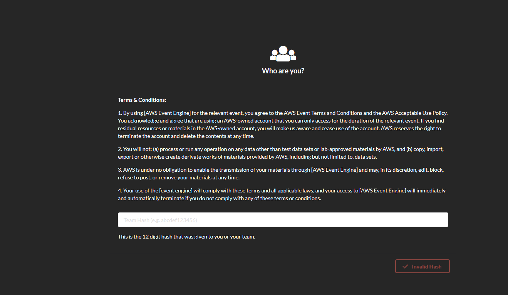

# AWS Security Workshop

## Sự giới thiệu
Bằng cách thực hiện các phòng thí nghiệm này, bạn sẽ hiểu các dịch vụ cơ bản và khái niệm bảo mật mà bạn cần triển khai trong Tài khoản AWS của mình.

[0. Prerequisites Lab](00-Prerequisites-Lab/README.md)

[1. CloudTrail Lab](01-CloudTrail-Lab/README.md)

[2. GuardDuty Lab](02-GuardDuty-Lab/README.md)

[3. Config Lab](03-Config-Lab/README.md)

[4. KMS Lav](04-KMS-Lab/README.md)

[5. Secrets Manager Lab](05-Secrets-Manager-Lab/README.md)

[6. WAF Lab](06-WAF-Lab/README.md)

[7. Analyze CloudTrail logs with Athena Lab](07-CT-Athena-Lab/README.md)

## Cách đăng nhập vào môi trường phòng thí nghiệm của bạn thông qua Event Engine

Trước khi bắt đầu các phòng thí nghiệm, bạn sẽ nhận được khóa băm để truy cập vào môi trường AWS của bạn. Bạn sẽ nhập khóa băm này vào Event Engine.

Địa chỉ url của Event Engine: https://dashboard.eventengine.run/login

Thiết lập tên nhóm của bạn nếu bạn muốn. Để truy cập bảng điều khiển te, nhấp vào __AWS Console__

Sau đó nhấp vào __Open Cosole__

You will see the AWS Console opening up

